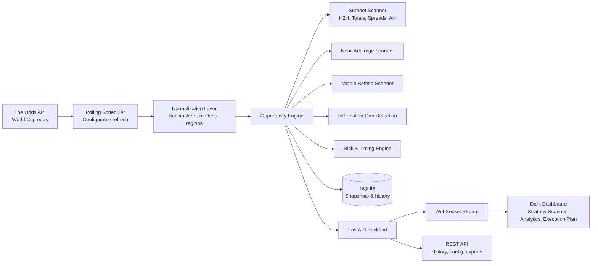
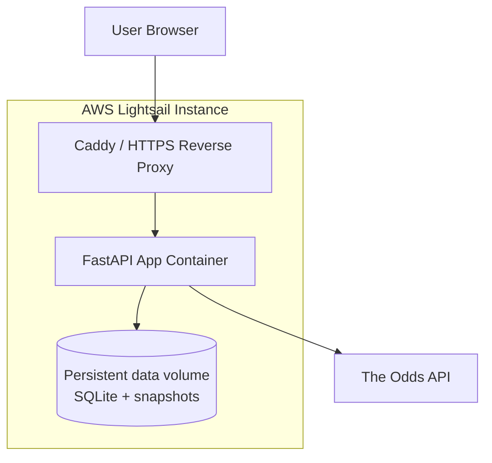

# WC2026 Arbitrage Console

**Not predicting outcomes. Exploiting inefficiencies.**

WC2026 Arbitrage Console is a real-time market intelligence platform for FIFA World Cup 2026 betting odds. It monitors bookmaker markets across regions, identifies pricing dislocations, and turns raw odds into structured decision-support signals.

The system is not designed to forecast match winners. It watches market structure: cross-book arbitrage, near-arbitrage, middle opportunities, and bookmaker divergence across 1X2, totals, spreads, and Asian handicap markets.

Built as a free, community-supported analytics platform.

## Dashboard Preview


## Product Overview

Modern betting markets behave like fragmented trading venues: prices move independently, liquidity varies by bookmaker, and short-lived inefficiencies appear when one venue updates faster or prices risk differently.

WC2026 Arbitrage Console turns that fragmented data into an operator-style dashboard:

- **Strategy-first signal discovery** instead of raw market browsing
- **Region-isolated scanning** so AU, EU, UK, US, and US2 markets are not mixed
- **Execution-aware opportunity cards** with stake allocation, expected profit, odds source, and timing windows
- **Risk context** for suspicious profit, extreme odds, same-bookmaker concentration, slippage, and event timing
- **Product analytics** showing which modules are actually producing value over today, 7 days, and all-time history

It is closer to a market monitoring console than a gambling tips site.

## System Architecture



## Core Capabilities

### Opportunity Engine

- **Surebets**: cross-book arbitrage across supported markets
- **Near Arbitrage**: closest prices to arbitrage threshold
- **Middle Betting**: cross-line sweet-zone opportunities
- **Information Gap**: bookmaker divergence and price spread ranking
- **Multi-Market Scanner**: totals, spreads, and Asian handicap signal coverage

### Execution Context

Each signal can include:

- Best available odds by leg
- Bookmaker source per leg
- Suggested stake allocation
- Expected profit
- Net result after simplified commission model
- Slippage buffer
- Average retained time
- Median retained time
- Current live duration
- Warning flags for suspicious or fragile opportunities

### Market Coverage

- H2H / 1X2
- Totals
- Spreads
- Asian Handicap
- Totals Middle

Optional markets such as BTTS, Double Chance, and Draw No Bet are represented in the UI as disabled modules when they are not requested from the current odds provider.

## Technology

The stack is intentionally simple, deployable, and infrastructure-friendly:

- **FastAPI** for the application backend
- **WebSocket streaming** for live dashboard updates
- **SQLite** for local persistence and historical signal analysis
- **Alpine.js** for a lightweight reactive dashboard
- **Tailwind CSS CDN** for the dark console UI
- **Docker / Docker Compose** for repeatable packaging
- **AWS Lightsail** deployment path for a small, cost-controlled public instance
- **The Odds API** as the live market data source

## Cloud Deployment Model

The project is designed to run as a compact single-service deployment:



For production-style hosting, the included Lightsail setup uses:

- Docker Compose service orchestration
- Caddy reverse proxy configuration
- Persistent mounted `data/` volume
- Environment-based API key configuration
- No checked-in secrets

See:

- `DEPLOY_DOCKER.md`
- `DEPLOY_LIGHTSAIL.md`

## Quick Start

Create a local environment file:

```bash
cp .env.example .env
```

Edit `.env`:

```bash
ODDS_API_KEY=your_the_odds_api_key
POLL_INTERVAL=30
DONATION_URL=https://buymeacoffee.com/neilsuuu
```

Run locally:

```bash
python run.py
```

Open:

```text
http://localhost:8000
```

## Docker

```bash
docker compose up --build -d
```

Stop:

```bash
docker compose down
```

## Configuration

Main configuration lives in `config.py`.

Important environment variables:

- `ODDS_API_KEY`: The Odds API key
- `POLL_INTERVAL`: odds polling interval in seconds
- `DONATION_URL`: optional community support link

## Repository Notes

The repository intentionally excludes runtime data:

- `.env`
- SQLite database files
- latest odds snapshots
- Python cache files
- local logs and deployment keys

Use `.env.example` and `deploy/lightsail/.env.lightsail.example` as templates.

## Community Support

WC2026 Arbitrage Console is free and community-supported. Donations help cover odds API usage, cloud hosting, storage, and future development.

Support link:

```text
https://buymeacoffee.com/neilsuuu
```

## Disclaimer

Advisory analytics only. Signals are decision-support outputs, not betting instructions or guarantees. Users remain solely responsible for execution, compliance, account eligibility, limits, and final outcomes.

Market data is sourced in real time through configured authorized odds API integrations.

## License

No license has been selected yet.
